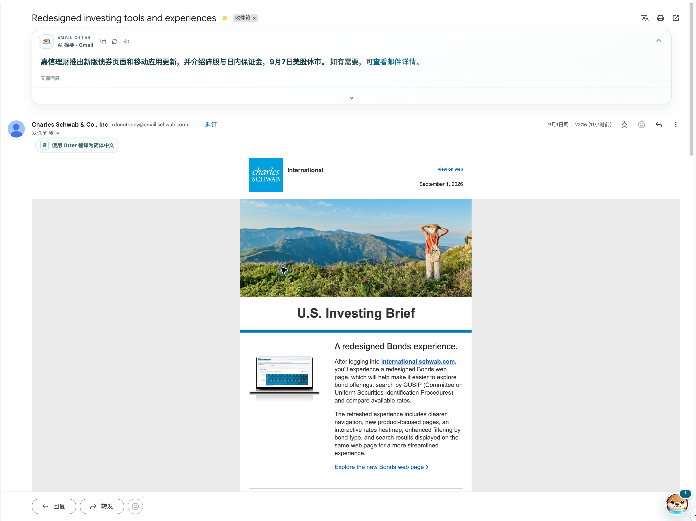
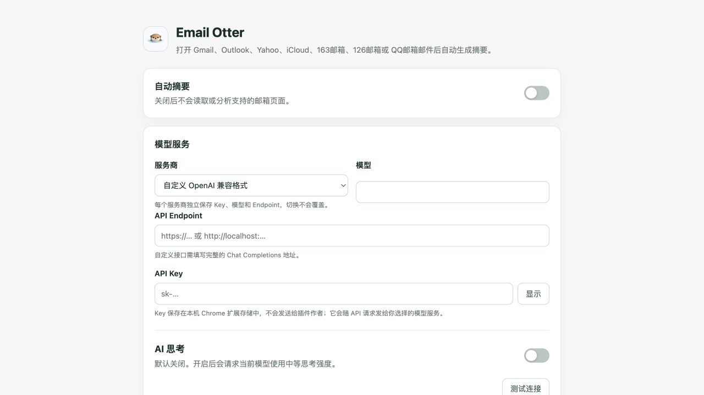

  

<h1 align="center">Email Otter</h1>

<em>A quiet AI copilot for the email you are reading.</em>

Email Otter 是一个 Chrome Manifest V3 扩展。它只处理你当前在网页邮箱中打开、且页面已经加载的邮件内容与必要上下文，使用你自己配置的模型 API Key 生成摘要、待办、回复草稿和翻译，并把结果直接显示在邮件页面中。

当前版本：`0.7.28`

> [!IMPORTANT]
> 本项目是 **source-available（源码可查看）** 软件，不是开源软件。仅授权自然人用于个人、非商业目的；禁止重新分发、镜像、重新打包、转售或转授权。完整条款以 [LICENSE](LICENSE) 为准。

## 支持的邮箱

- Gmail
- Outlook
- Yahoo Mail
- iCloud Mail
- 163 邮箱
- 126 邮箱
- QQ 邮箱

Email Otter 不接入邮箱 OAuth，也不会在后台扫描整个收件箱。它通过各邮箱当前网页的 DOM 读取已经打开的邮件。

## 主要能力

- **快速摘要**：先生成一句直接结论；需要回复时可同时给出最多 1 项待办和 2–3 条跟进回复方向，明确无需回复时不生成待办或回复方向。
- **详细摘要**：默认按需展开更完整的内容，避免每封邮件一开始就产生额外调用；也可开启“始终展开详细总结”。
- **Otter 待办球**：汇总识别到的待办，可打开原邮件、标记完成或移除；不会修改原邮件。
- **回复草稿**：提供跟进方向并按需生成草稿。Gmail 可插入原生回复框，其他邮箱可编辑和复制；始终不会自动发送。
- **全文翻译**：按需把当前已加载的邮件正文翻译为简体中文，并保留原文。
- **Token 记录**：在本机记录快速摘要和详细摘要请求的输入、输出与合计 Token 数量；回复草稿、全文翻译和连接测试目前不计入。
- **多模型服务商**：支持 OpenAI、Google AI Studio（Gemini）、DeepSeek、OpenRouter，以及自定义 OpenAI 兼容接口。

## 界面预览

### 邮件摘要与操作

实际界面示例；邮件内容与第三方商标仅用于展示兼容场景，权利归各自权利人所有。

### 模型与摘要设置

## 安装

Email Otter 目前通过 Chrome 的“加载已解压的扩展程序”方式安装：

1. 从 GitHub **Releases** 下载 ZIP；也可以点击仓库右上角 **Code → Download ZIP**。
2. 解压下载的 ZIP。
3. 在 Chrome 地址栏打开 `chrome://extensions`。
4. 打开页面右上角的“开发者模式”。
5. 点击“加载已解压的扩展程序”。
6. 选择解压后包含 `manifest.json` 的 `gmail-ai-inline-summary 2` 文件夹。
7. 点击 Chrome 工具栏中的 Email Otter 图标，打开“模型与摘要设置”。
8. 选择模型服务商，填写你自己的 API Key 和模型，然后保存。
9. 刷新已打开的网页邮箱，进入一封邮件即可使用。

更新版本时，请先下载并解压新版，再在 `chrome://extensions` 中重新加载对应文件夹。请从本仓库获取发布包，不要使用第三方重新打包或转载的副本。

## BYOK 模型配置

Email Otter 采用 BYOK（Bring Your Own Key）方式：开发者不提供共享 API Key 或模型额度。你可以在设置页分别配置：

- OpenAI 官方 Responses API；
- Google AI Studio / Gemini API；
- DeepSeek；
- OpenRouter；
- 自定义 OpenAI Chat Completions 兼容接口，包括用户主动配置的本机接口。

模型 API 的可用性、速率限制和费用由相应服务商及你的账户方案决定，产生的调用成本由你自行承担。建议使用专用 Key，并在服务商后台设置合理的额度限制。

## 隐私与安全

- 扩展只从当前打开的邮箱线程 DOM 中提取已经加载的内容，包括主题、每封已加载邮件的正文、发件人、页面显示时间，以及可见的附件名称或标签；附件文件本身不会被读取或上传，也不会通过邮箱 OAuth 读取整个邮箱账户。
- 快速摘要、详细摘要、回复草稿和全文翻译会把上述模型输入按各功能的字符上限发送到你选择的模型服务商或自定义 Endpoint；生成回复时还会发送你点击的回复方向，线程过长时优先保留较新的邮件。数据处理同时受该服务商的条款与隐私政策约束。
- Email Otter 没有开发者后端，也没有统计、广告追踪或埋点；开发者不会通过本扩展接收你的邮件正文或 API Key。
- API Key、服务商设置、摘要缓存、全文翻译、待办条目和 Token 用量记录保存在本机 Chrome 扩展存储中。待办包含文本、邮箱标签、邮件主题、邮件 URL、时间戳和内容签名；Token 记录包含时间、邮箱标签、模型、邮件主题、摘要阶段、线程邮件数与 Token 数，但不保存原始正文。回复草稿不会由 Email Otter 持久化到扩展存储。
- API Key 发起请求时会作为认证凭据发送到你选择的模型 Endpoint。Chrome 本地扩展存储不是专用密码保险箱，请保护好设备和浏览器配置。
- 从设置页导出的配置 JSON 会以明文包含全部服务商的 API Key；只应保存到可信位置，不要上传、分享或提交到版本控制。
- 扩展不会读取或复用本机 Codex、ChatGPT 或其他客户端的登录 Token、Cookie、订阅凭据和私有配置。ChatGPT/Codex 订阅也不等同于 OpenAI Platform API Key。
- 邮件属于不可信输入。扩展会降低提示注入风险，但任何模型都可能误解内容或生成错误信息。

涉及付款、账号安全、交易、合同、法律、医疗、金额、日期或截止时间时，请务必核对邮件原文和权威来源，不要仅依据 AI 输出采取行动。

## 已知限制

- Email Otter 依赖邮箱网页的 DOM 结构。邮箱服务商更新页面后，某些站点可能暂时无法识别正文或正确插入界面。
- 扩展只处理当前打开且已加载的内容。长邮件线程中尚未展开或尚未加载的正文不会被总结。
- 当前不接入 Gmail、Outlook 或其他邮箱的 OAuth/API，因此不会后台预摘要收件箱，也不会监听未打开的邮件。
- 模型输出质量取决于邮件内容、所选模型和服务商；BYOK 服务的费用、可用性和数据政策不由本项目控制。
- 手动安装的扩展不会像 Chrome 应用商店版本一样自动更新。

如果遇到邮箱页面适配问题，可以在本仓库提交 Issue，并说明邮箱服务、浏览器版本和复现步骤。提交截图前请遮盖姓名、邮箱地址、邮件正文、订单号、API Key 等敏感信息。

## 许可

本仓库公开源码仅用于审阅、学习和按许可安装使用。根据 [Email Otter Personal Use License](LICENSE)：

- 仅自然人可以将本软件用于个人、非商业目的；
- 不得用于公司业务、受雇工作、客户服务、收费产品、广告或其他商业活动；
- 不得分发源码或二进制副本，包括重新上传、镜像、重新打包、托管、转售或转授权；
- 如需向他人介绍 Email Otter，请分享本 GitHub 仓库的原始链接，而不是传播代码或 ZIP 副本；
- 商业使用或其他授权必须事先取得单独的书面许可。

GitHub 的公开仓库机制允许用户依照 GitHub 服务条款在站内查看和 fork；本许可证明确保留这一平台边界，但不因此授权商业使用或站外再分发。

以上只是便于阅读的摘要，不替代 [LICENSE](LICENSE) 正文。仓库中的第三方组件仍适用各自的许可证，详见 [THIRD_PARTY_NOTICES.md](THIRD_PARTY_NOTICES.md)。

## 免责声明

本软件及 AI 生成内容按“现状”提供，不附带任何明示或默示保证。在适用法律允许的最大范围内，作者和版权方不对因安装、使用、无法使用本软件，或依赖模型输出而产生的损失承担责任。模型服务商、网页邮箱和 Chrome 的服务变更可能影响本扩展的可用性。
